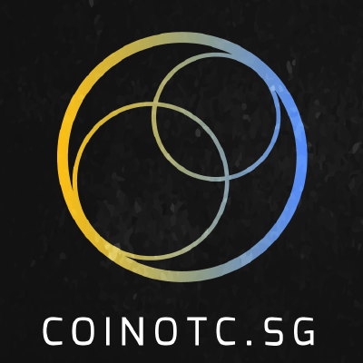

> ### CoinOTC Wallet API spec.

# Pre-requisite
- MongoDB
- Cardano Wallet Client
- Monero CLI package from master branch (if production then is the binaries)
- Postman
- Geth from Ethereum
- Docker CE Ubuntu

# Dockerize CoinOTC Wallet API

https://www.digitalocean.com/community/tutorials/how-to-install-and-use-docker-on-ubuntu-16-04

Build the wallet api docker image 
```
docker build -f Dockerfile.stack --force-rm --compress -t coinotc-wallet-api-nodejs:latest .

docker build -f Dockerfile.api --force-rm --compress -t coinotc-wallet-api:latest .

```
Run the wallet api docker image
```
docker run -t -i -v /media/kenneth/b13ae9f7-5727-4bc0-94fe-77d72079f2ee:/root/blockchain-drive  --env-file ./docker.env coinotc-wallet-api /bin/bash
```

## Global Wallet Password

* Currently this is the global wallet password being used across crypto currencies.

123456h67890Fsfrdssdcdredsafd432

# Ethereum

Start the geth daemon to sync the ethereum blockchain dataset
```
geth --datadir=/media/kenneth/b13ae9f7-5727-4bc0-94fe-77d72079f2ee/eth/.rinkeby console --ethstats='kenken6443443:Respect my authoritah!@stats.rinkeby.io' --networkid=4 --rinkeby --rpc --rpcapi="db,eth,net,web3,personal,web3" console
```
Use metamask as wallet then fund the ether from testnet
https://www.rinkeby.io/#faucet

Use the below social links to fund ethers.
https://www.facebook.com/kenneth.phang1/posts/10155654195609205
https://twitter.com/bunnyppl/status/992300105855258624


Existing wallet for testing
```
address : 0xD0d3E63c29679940e169526233E5A0B1eef61863
private key : 0xee29f4b5f78d3caba91f5a7032109953d8a620b04f8c3ebc4fd89c528493c34f
phrases: prevent obey must primary cigar screen taste early thought bench note distance


address: 0xee0607f50399ce22c6AF33AF16aCB504A31500aB
private : 0x9f532664cf0aaecdcbfe80d2ba7b0714361c35e1caf22c7842ac14a9fd80706b
phrases: noble picture thumb add girl couple estate tone face sorry flat apology

0x0DAdD74887E12Bf668f7376c6af5237c03bF05fC
0xb996991b3e37cdf5420f9db6f0f858c5f45996bcdc6d204bf21de0edc8f5bfbd

0xC24E24a083C2A7B00c94e2B5D14De3B7ED39d8c1
0xbeae58f4ff545bd10fead52710c06369c9355aac2407628ffd05a0c16a4232f9
slogan scare major material fun cloud merge document piano chunk hire slender
```

# Monero
We need to checkout the master branch of the monero cli, rpc and daemon, build it follow the instructions provide on their README.md before running against the monero blockchain dataset
```
./monero-wallet-cli --testnet --wallet-file /media/kenneth/b13ae9f7-5727-4bc0-94fe-77d72079f2ee/monero-data-test/wallet/zjoqD --mnemonic-language English --password 123456h67890fsfrdssdcdredsafd432 --daemon-address 127.0.0.1:28081
```
According to your wallet (not the protocol) you have to wait 10 blocks (roughly 20 minutes) before you can spend newly received xmr. The is a measure for increased untraceability.

```
./monerod --testnet --data-dir /media/kenneth/b13ae9f7-5727-4bc0-94fe-77d72079f2ee/monero-data-test --hide-my-port --no-igd
```
if we need to fund the wallet please include --start-mining <monero address> --mining-threads 9

```
./monero-wallet-rpc --testnet --daemon-address 127.0.0.1:28081 --wallet-dir /media/kenneth/b13ae9f7-5727-4bc0-94fe-77d72079f2ee/monero-data-test/wallet --disable-rpc-login --rpc-bind-port 7879 --rpc-bind-ip 127.0.0.1 --trusted-daemon
```

* Account information #1

9umVqmjdqwyCLJ6NPPBzAi4x3tN9aTUhe4DYW3Dc2qwLi3nDbxxXQxK2DqPqwxVJmVWQqVdw9HnkadLTzqzj5eiyRHrbUb9

wallet filename
zjoqD

omission ingested guarded rising sorry pitched ravine kiwi
joining winter antics jaws orchid knowledge usher sawmill
almost enraged catch gambit pedantic voyage ethics gasp omission

2fa71795c6f096169762a8febc6aa632e348577e68f581e31e06039b09760e0e

d99f64f11161a2dc98ec78fb7c31fa622a88db728a0a7638d1a31353ac458c0e

omission ingested guarded rising sorry pitched ravine kiwi joining winter antics jaws orchid knowledge usher sawmill almost enraged catch gambit pedantic voyage ethics gasp omission

* Account information #2

9ssair3Egf4MqaGn7pkqJGbDpp6qGPiN9DYVHyA1RaNoFefeSsmkuPhXVkhuwQAiqJYUeoRQXsSMtYXt7343dYniDSHVu8C
spendkey
b1d67f845c91236b18ae5e3374895ee0908c50f7f6bc1dd526ea51ccf573c500
129f50bf25dba37c94422345e2aed1cc983aae8dcaecae4afd32f0492924f457

viewkey
secret: fae01c13e615fef6ff7a540503d044b6e0fd45c1a708ee76aba54679ad322b0b
public: 954992c343cdecb6527a735a6fd14dbc2fed6721dd7a4fbc85252b615550d76e

# Cardano

Websocket Server for cardano started on port 8077

## Build Cardano From Source

* https://github.com/input-output-hk/cardano-sl/blob/develop/docs/how-to/build-cardano-sl-and-daedalus-from-source-code.md

## How to connect to cluster
1. Make sure you’ve follow the instructions to build from source using Nix
2. Make sure you’re on latest cardano-sl-X.X branch
3. To build a script that will contain everything needed to connect to mainnet: $ nix-build -A connectScripts.mainnetWallet -o connect-to-mainnet
4. Alternatively you can connect to different environments and different executables by building the scripts:
5. Explorer node with mainnet: `$ nix-build -A connectScripts.mainnetExplorer -o connect-explorer-to-mainnet
6. Wallet to staging: $ nix-build -A connectScripts.stagingWallet -o connect-to-staging
7. Explorer to staging: $ nix-build -A connectScripts.stagingExplorer -o connect-explorer-to-staging
8. A runtime state folder will be automatically created relative to your current working directory, but you 9. can override it using $ export CARDANO_STATE_DIR=~/wallet-state
10. Run the script: $ ./connect-to-mainnet Or run ./connect-explorer-to-mainnet if you might want to connect anything listed in 4.

## Configure debug logging to info
sudo nano /nix/store/39p2dbldbxzhk4278b0rkhg417bgcrzk-cardano-config/log-config-connect-to-cluster.yaml

```
# This template is used in scripts to connect to a running cluster.
# In particular, it's used by exchanges, so it should be maintained carefully.

rotation:
    logLimit: 104857600 # 100MB
    keepFiles: 100
loggerTree:
  severity: Info+
  files:
    - node.pub
    - node

```

```
scripts/startCardanoEngine.sh
```

this start script will run the websocket server.

In order to tunnel this through internet download ngrok 

```
ngrok http 8080 -subdomain=coinotc-ada
```

# Ripple

Just start the websocket server for ripple

```
cd $COINOTC_WALLET_API_PROJ
nodemon ripple-ws.js
```
debug: received: {"type":"generateAddress","email":"bunnyppl@yahoo.com"}
debug: connected
debug: {"type":"generateAddress","account":{"secret":"shykL2oKhS6uQRxPgtMb4npjCuYTg","address":"rTRHUpcvnDh62CPzHwrL54mQGFUYo98jb"},"email":"bunnyppl@yahoo.com"}
debug: disconnected, code: 1000
debug: received: {"type":"generateAddress","email":"bunnyppl@gmail.com"}
debug: connected
debug: {"type":"generateAddress","account":{"secret":"sn2djnspGAjdHNSVbbRZGWGGRa3fu","address":"rJrY2kvifcNGRbp8uq35oTRadzqB7qV7qM"},"email":"bunnyppl@gmail.com"}
debug: disconnected, code: 1000


# Stellar 
Just start the websocket server for stellar

```
cd $COINOTC_WALLET_API_PROJ
nodemon stellar-ws.js
```
received: {"type":"generateAddress","email":"bunnyppl@yahoo.com"}
debug:   Public address: GC5LVRZ64EBSOQTKVNRG2JFZW4J7CQ42MDZMTEDRZLUGQ7RYEGOLPWKD
debug:   Wallet secret: SC3L4FQXZX3S3J36HRMTMTDEGZBRUMUAJLLWIWZROXWRIFX37NYPSAUJ 

debug:   Print this wallet and make sure to store it somewhere safe! 

debug:   Note: You need to put at least 20XLM on this key for it to be an active account 

debug: received: {"type":"generateAddress","email":"bunnyppl@gmail.com"}
debug:   Public address: GAZPKLJPLYDCAJXY3XRLGHGTK5SKJVSUOAH23DU6PPU4WLTJZ3KPVKWK
debug:   Wallet secret: SCOPV4NH3OKEZTQVC7QM7A7WP2WFXV5BTHZPZEFJPMREFU2JHLLZKAGE 

# API Wallet Microservices

Make sure all the above dependencies is UP if not there is no way the API microservice will be functioning properly.
$COINOTC_WALLET_API_PROJ/nodemon app.js

# CoinOTC transaction fee (Smart Contract Solidity)

We need to list our ERC20 token to reputable Crypto Exchange to reverse back to Ethereum for the cash out.

* https://hackernoon.com/how-to-transfer-zrx-tokens-to-poloniex-70c20704669d
* https://ethereum.stackexchange.com/questions/29437/how-to-convert-erc-20-tokens-back-to-ethereum

## Setup

* Install truffle a scaldfolding framework for Ethereum smart contract
* Install the solidity compiler 

```
npm install -g truffle

npm install -g solc
```
## Connecting Metamask to Ethererum Geth RPC

Create a ethereum wallet account for testing.

* Compile:        truffle compile
* Migrate:        truffle migrate
* Test contracts: truffle test


# Environment variables (.env)
```bash
API_SECRET=password@123456
WEB_SECRET=password@12345632
MONERO_HOSTNAME=127.0.0.1
MONERO_PORT=7879
ETH_RPC=http://localhost:8545
GETH_ADDRESS=localhost
GETH_PORT=8545
ETHTESTNET=true
RIPPLE_API=wss://s.altnet.rippletest.net:51233
RIPPLE_WS_CLIENT=ws://localhost:8080
RIPPLE_WS_SVR_PORT=8080
STELLAR_SERVER=https://horizon-testnet.stellar.org
STELLAR_WS_PORT=8081
STELLAR_WS_ADDRESS=ws://localhost:8081
MONGODB_URI=mongodb://localhost/walletapi
MONGODB_DEBUG=true
CARDANO_WS_ADDRESS=ws://coinotc-ada.ngrok.io
CARDANO_CLIENT_KEY=certificates/client.key
CARDANO_CLIENT_CERT=certificates/client.crt
CARDANO_HEX_RANDOM=ABCDEFGHIJKLMNOPQRSTUVWXYZabcdefghijklmnopqrstuvwxyz0123456789+/
APPLOGFILE=combined.log
PORT=3001
COINOTC_ESCROW_EMAIL=admin@nimbus.sg
WEBAPP_PORT=3002
```

Explanation :

As an example, when you send a transaction, your wallet uses one of the 'bills' it has, say 10 xmr. However, you want to pay someone only 3 xmr, so what happens then? Your wallet splits the 10 xmr into brand new 3 + 7, sends the 3 to your recipient, and 7 back to yourself. Because both the 3 and the 7 bills are brand new, you have to wait until you can spend those.

This repo is functionality complete — PRs and issues welcome!

# Security Consideration

* https://expressjs.com/en/advanced/best-practice-security.html
* https://www.npmjs.com/package/express-limiter
* https://www.npmjs.com/package/csurf
* https://nmap.org/
* https://github.com/nabla-c0d3/sslyze
* https://www.npmjs.com/package/safe-regex

# Getting started

To get the Node server running locally:

- Clone this repo
- `npm install` to install all required dependencies
- Install MongoDB Community Edition ([instructions](https://docs.mongodb.com/manual/installation/#tutorials)) and run it by executing `mongod`
- `npm run dev` to start the local server

Alternately, to quickly try out this repo in the cloud, you can [](https://glitch.com/edit/#!/remix/realworld)

# Code Overview

## Dependencies

- [expressjs](https://github.com/expressjs/express) - The server for handling and routing HTTP requests
- [mongoose](https://github.com/Automattic/mongoose) - For modeling and mapping MongoDB data to javascript 
- [mongoose-unique-validator](https://github.com/blakehaswell/mongoose-unique-validator) - For handling unique validation errors in Mongoose. Mongoose only handles validation at the document level, so a unique index across a collection will throw an exception at the driver level. The `mongoose-unique-validator` plugin helps us by formatting the error like a normal mongoose `ValidationError`.

## Application Structure

- `app.js` - The entry point to our application. This file defines our express server and connects it to MongoDB using mongoose. It also requires the routes and models we'll be using in the application.
- `config/` - This folder contains configuration for passport as well as a central location for configuration/environment variables.
- `routes/` - This folder contains the route definitions for our API.
- `models/` - This folder contains the schema definitions for our Mongoose models.
- `util/` - This folder contains the helper js.
- `wallet/` - This folder contains wallet integration.


## Error Handling

In `routes/api/index.js`, we define a error-handling middleware for handling Mongoose's `ValidationError`. This middleware will respond with a 422 status code and format the response to have [error messages the clients can understand]

## Authentication

Requests are authenticated using the `Authorization` header with a valid API key. 

<br />

Brought to you by Nimbus LLP (Singapore)